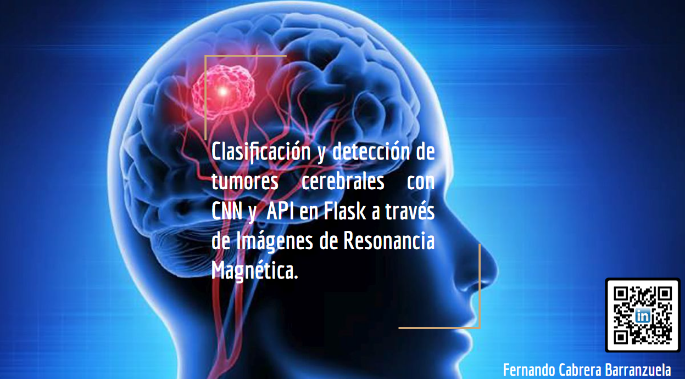

# **ACERCA DE MI**

Científico de datos e ingeniero agrónomo poseo una sólida experiencia en la recopilación, transformación y análisis de datos complejos para consolidar conocimientos valiosos. Mi dominio en esta área me permite abordar una amplia gama de desafíos empresariales con un enfoque basado en datos. Apasionado por el aprendizaje continuo y orientado a la innovación. 

## Habilidades técnicas

## Contactame

## Experiencia Laboral

### Omdena

**Junior Machine Learning Engineer (12/2024 – actualmente)**

- Preproceso los datos utilizando herramientas en Python como Pandas, Numpy y Scikit-learn.
- Descubro insights de la visualización de los datos en matplotlib, seaborn, plotly y Power BI.
- Entreno y evaluo modelos con herramientas como Tensorflow con el objetivo de realizar predicciones o resaltar información destacada en función de las metas establecidas. 
- Colaboró con el equipo de desarrollo en el despliegue de la interfaz interactiva que permita la entrada de datos, incluyendo actualizaciones meteorológicas y movimientos de población, con 
generación de predicciones en tiempo real.
- Trabajo con distintos clientes y equipos para los proyectos realizados de diferentes industrias

---

# **PROYECTOS SELECCIONADOS**

## Clasificacion y deteccion de tumores cerebrales con despliegue de API en FLASK / Junio - Octubre 2024

**Herramientas del proyecto:**

 

**Fases:**

- EDA respectivo con los archivos csv
- Preprocesaniento de imagenes para un formato optimo para la construccion del modelo
- Análisis exploratorio de datos para crear insights sobre el comportamiento de las imagenes y determinar su clasificacion 
- Contruccion de la red CNN.
- Metricas de evaluacion, dando al modelo como optimo.
- Uso de API desarrollada con Flask que permite subir imágenes de MRI y obtener predicciones en tiempo real.
- Despliegue utilizando Docker en Google Cloud Platform (GCP), asegurando escalabilidad y eficiencia.
- **Explora más detalles del proyecto en el [repositorio completo](https://github.com/Ferx096/brain_tumor_detector/tree/master).**

---

## Analisis y clasificiacion de imagenes de mamografia con modelos preentrenados - version1 / Noviembre - Enenro 2025
**Herramientas del proyecto:**

 

**Fases:**

- Exploración y preprocesamiento de Datos
- Visualización y aumento de Datos
- Extracción de características con modelos preentrenados.
- Selección de los mejores modelos utilizando informacion mutua, filtrando los mejores resultados de umbrales.
- Construcción de un modelo ensemble utilizando SVC, NuSVC y RandomForest para lograr un equilibrio en el sobreajuste
- **Explora más detalles del proyecto en el [repositorio completo](https://github.com/Ferx096/v1_breast_cancer_m).**

